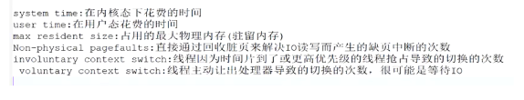
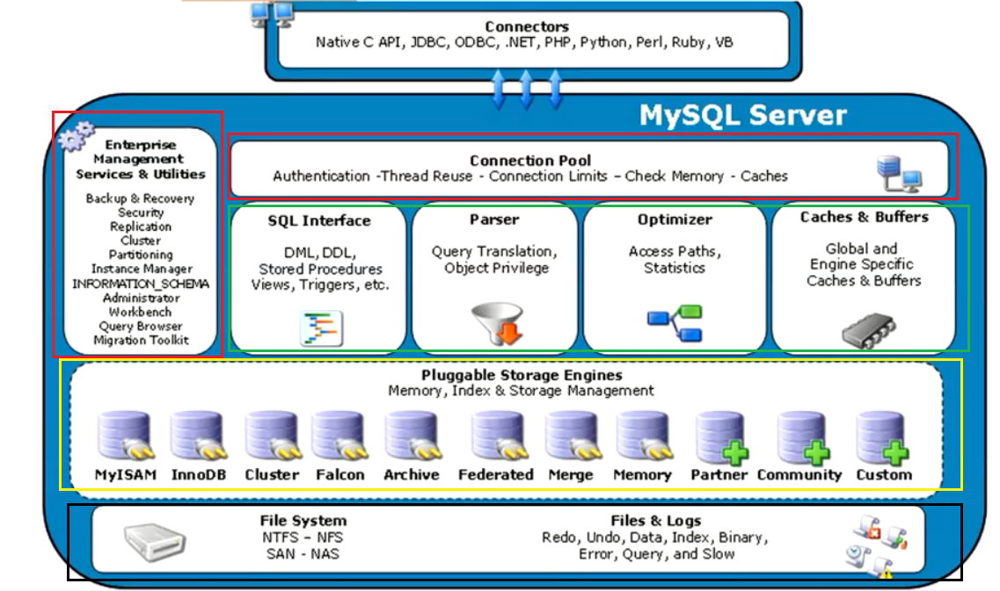
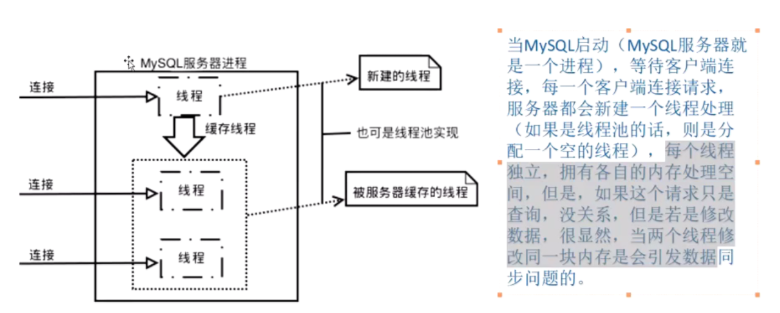
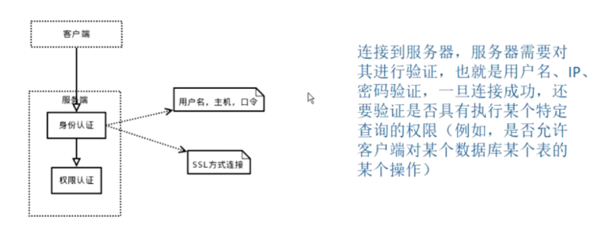
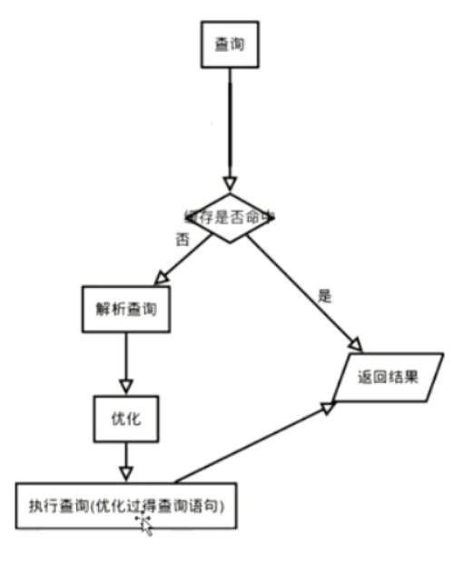
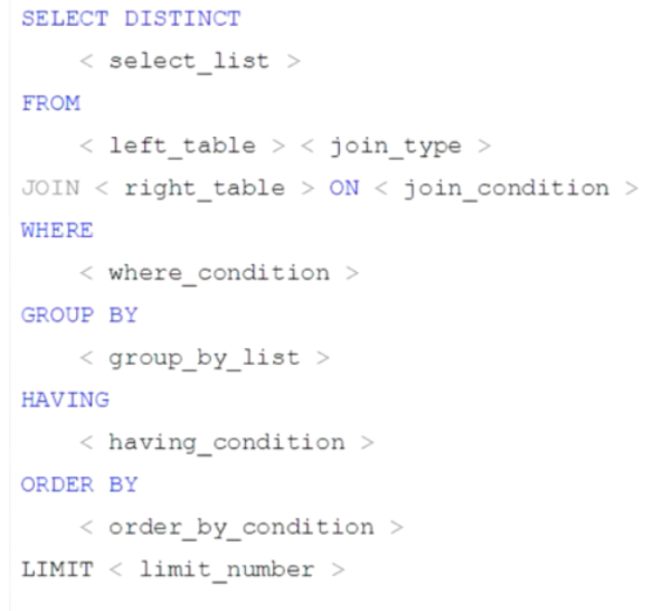
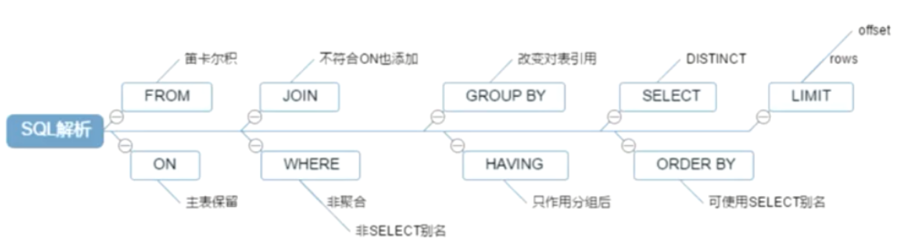
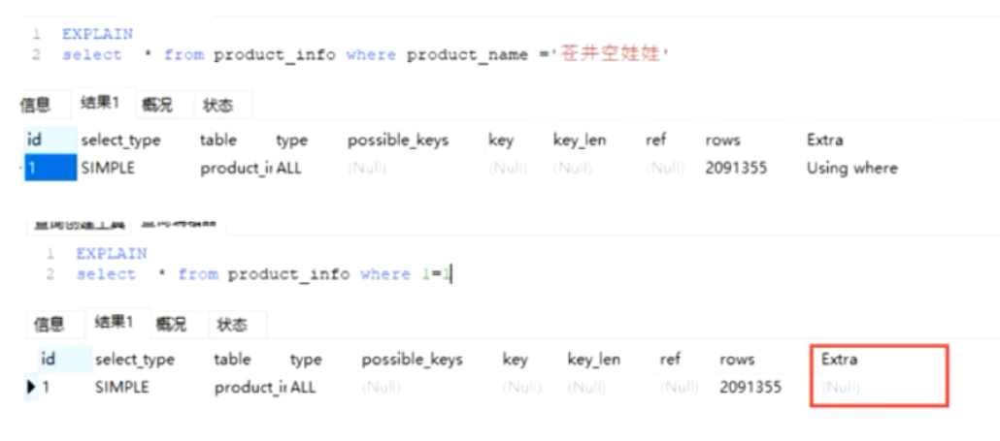
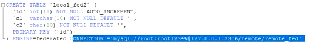

# MySQL

## 0、MySQL优化

- 用PreparedSatement而不是拼接SQL语句
- 如果是查询的话用MyISAM存储引擎效率更高
- 使用索引

## 1、MySql逻辑架构

衡量指标：

计算方法：

UPTIME：启动时间

MySQLSlap简介：

使用1：

--concurrency=N, -c N 表示并发量，也就是模拟多少个客户端同时执行select。可指定多个值，以逗号或者--delimiter参数指定的值做为分隔符。例如：--concurrency=100,200,500。

--iterations=N, -i N 测试执行的迭代次数，代表要在不同并发环境下，各自运行测试多少次，求一个平均值。指的是整个步骤的重复次数，包括准备数据、测试load、清理。

--auto-generate-sql, -a 自动生成测试表和数据，表示用mysqlslap工具自己生成的SQL脚本来测试并发压力。

--auto-generate-sql-add-auto-increment 代表对生成的表自动添加auto_increment列，从5.1.18版本开始支持。

--engine=engine_name, -e engine_name 代表要测试的引擎，可以有多个，用分隔符隔开。例如：--engines=myisam,innodb。

--number-of-queries=N 总的测试查询次数(并发客户数×每客户查询次数)，比如并发数是10，总次数是100，那么十个客户端各执行10个。

--debug-info  打印内存和CPU信息（Linux可用）

使用2：

输出解释：

使用3：

查询MyISAM更快。

MySQL分层：

红色框：连接层

绿色框：服务层

黄色框：存储引擎层

黑色框：文件系统层

## 1.1、连接层

### 1.1.1、MySQL启动

### 1.1.2、MySQL连接

## 1.2、服务层

### 1.2.1、流程图

### 1.2.2、 缓存

> #数据缓存是否开启
>
> SHOW variables LIKE '%query_cache_type%';
>
> #缓存的大小
> SHOW VARIABLES LIKE 'query_cache_size'
>
> #设置缓存大小(命令修改即将废除)
> SET GLOBAL query_cache_size=1039360
>
> 推荐修改my.ini文件来修改这些配置

### 1.2.3、解析查询

### 1.2.4、优化

## 1.3、引擎层

MyISAM和InnoDB是重点

> #查看支持的存储引擎
> SHOW engines

### 1.3.1、MyISAM存储引擎

MySQL5.5以前默认的引擎（我们公司是5.1.46，但默认引擎被设置成了InnoDB），MyISAM引擎创建的表在存储是一共有三个文件，分别是.frm文件、.MYD文件、.MYI文件

> tablename.frm文件：存储表结构，是任何存储引擎都具备的
>
> tablename.MYD文件：数据库文件
>
> tablename.MYI文件：索引文件，由于索引与数据库文件是分开存放的，所以这里的索引又叫做非聚集索引

**MyISAM特性：**

> 并发性与锁级别-表级锁，不支持行级锁
>
> 支持全文索引
>
> 支持数据压缩
>
> > 压缩数据举例：myisampack -b -f tablename.MYI

**MyISAM适用场景：**

> 非事务型应用（数据仓库、报表、日志数据）
>
> 只读类应用
>
> 空间类应用（空间函数、坐标）

### 1.3.2、InnoDB存储引擎

MySQL5.5及以后版本默认的存储引擎。

> #查看创建表的时候是否默认创建独立表空间，若为on则为新表创建独立表空间，若为off则不创
>
> SHOW VARIABLES LIKE 'innodb_file_per_table';
>
> #修改innodb_file_per_table默认值
>
> SET GLOBAL innodb_file_per_table=off;
>
> MySQL5.6以前创建新表的时候默认不会创建对应的独立表空间，默认放在系统表空间，MySQL5.6及以后都会默认创建独立表空间，innodb_file_per_table默认为on，**我们公司之所以一张表一个数据库可能就是为了实现一张表一个表空间**。
>
> 系统表空间对应的存储文件名：ibdataX
>
> 独立表空间对应的存储文件名：tablename.ibd

**若innodb_file_per_table为on，创建一张新表的时候会创建两个文件:**

> tablename.frm：存储表结构，是任何存储引擎都具备的
>
> tablename.ibd：innoDB的表空间文件，包括了数据库文件和索引文件，相当于MyISAM的MYD和MYI文件的合并

**若innodb_file_per_table为off，创建一张新表的时候只会创建一个文件：**

> tablename.frm：存储表结构，是任何存储引擎都具备的
>
> > 此时本因该存储在tablename.ibd文件里面数据存储到了系统表空间，也就是ibdataX.ibd文件

**系统表空间与独立表空间区别：**

> - 系统表空间无法简单的收缩文件大小
> - 独立表空间可以通过‘OPTIMIZE TABLE tablename’语句收缩文件大小（比如.ibd文件，当删除大量记录时可以用该命令节省磁盘空间，类似于磁盘整理）
> - 系统表空间会产生IO瓶颈
> - 独立表空间可以同时向多个文件刷新数据

**Innodb的特性：**

- 是一种事务型存储引擎

- 完全支持事务的ACID特性

- Redo Log和Undo Log（注意不是二进制日志）

  redo log 是重做日志，提供 **前滚** 操作；undo log 是回退日志，提供 **回滚** 操作。

- Innodb支持行级锁（并发程度更高）

**适用场景：**

- MyISAM适用于大多数OLTP应用（OLTP：On-Line Transaction Processing，联机事务处理）

**MyISAM于InnoDB对比：**

| 对比项   | MyISAM                                                     | InnoDB                                                       |
| -------- | ---------------------------------------------------------- | ------------------------------------------------------------ |
| 主外键   | 不支持                                                     | 支持                                                         |
| 事务     | 不支持                                                     | 支持                                                         |
| 行表锁   | 锁表，即使操作一条数据也会锁住整个表，不适合高并发的操作。 | 行锁，操作时只锁住某一行，不对其他行有影响，适合高并发的操作。 |
| 缓存     | 只缓存索引，不缓存真实数据                                 | 不仅缓存索引还有缓存真实数据，对内存要求较高，而且内存大小对性能有决定性的影响。 |
| 表空间   | 小                                                         | 大                                                           |
| 关注点   | 性能（查询的性能很高）                                     | 事务                                                         |
| 默认安装 | Yes                                                        | Yes                                                          |

### 1.3.3、CSV存储引擎

一种文本存储方式的引擎。

**CSV存储引擎的文件组成：**

- .CSV文件：存储数据内容
- .CSM文件：存储表的元数据，如表状态和数据量
- .frm文件：存储表结构

**特点：**

- 以csv文件进行数据存储
- 所有列都不能为null
- 不支持索引（不适合大表、不适合在线处理）
- 可以对数据文件进行直接编辑（注意编辑完csv文件后执行sql：flush tables，且编辑csv文件时注意csv文件最后一行有一个回车符）

### 1.3.4、Archive存储引擎

**archive引擎文件组成：**

- .ARZ文件：以zlib对表数据进行压缩，磁盘I/O更少的数据存储建议用该引擎
- .frm文件：如上

**特点：**

- 只支持insert和select操作
- 只运行在自增ID列上加索引

**使用场景：**

- 日志和数据采集应用

### 1.3.5、Memory存储引擎

**特点：**

- 文件系统存储特点：

  > 也称HEAP存储引擎，所以数据保存在内存中，重启数据库就没了，但有frm文件，存储表结构

- 支持HASH索引和BTree索引

- 所有字段都是固定长度，varchar(10)==char(10)

- 不支持Blog和Text等大字段

- Memory存储引擎使用表级锁

- 最大大小由max_heap_table_size参数决定

memory存储引擎与临时表：
$$
临时表= 
\begin{cases}
mysql使用临时表：
\begin{cases}
超过限制使用MyISAM临时表\\
未超过限制使用Memory临时表\\
\end{cases}\\
用户使用临时表：用SQL语句'create-temporay-table'建立临时表
\end{cases}
$$

### 1.3.5、Ferderated存储引擎

**特点：**

- 提供访问远程MySQL数据库上表的方法
- 本地不存储数据，数据都全部放到远程服务器上
- 本地需要保存表结构和远程服务器的连接信息

**使用场景：**

- 偶尔的统计分析及手工查询

**实例：**

## 1.4、文件存储层

就是上面介绍存储引擎的时候那些文件。
