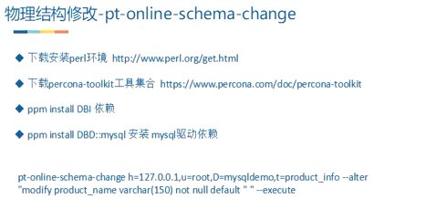

# 锁+事务

## 1、锁的简介

### 1.1、为什么需要锁

共享资源的竞争

### 1.2、锁的概念

- 锁是计算机协调多个进程或线程并发访问某一资源的机制
- 在数据库中，数据也是一种供多个用户共享的资源。如何保证数据并发访问的一致性、有效性是所有数据库必须解决的问题，锁冲突也是影响数据库并发访问性能的一种重要因素。
- 锁对数据库而言显得尤为重要，也更加复杂。

### 1.3、MySQL中的锁

MySQL的锁机制比较简单，最显著的特点是不同的存储引擎支持不同的锁机制：

比如：MyISAM和Memory存储引擎使用的是表级锁，InnoDB存储引擎即支持行级锁，又支持表级锁。但默认情况下是采用行级锁。

**锁列别：**

- 表级锁：开销小、加锁快；不会出现死锁；加锁粒度大，发生锁冲突的概率最高，并发度最低。
- 行级锁：开销大、加锁慢；会出现死锁；锁粒度最小，发生锁冲突的概率最低，并发度也最高。
- 页面锁：开销和加锁时间介于表锁和行锁之间；会出现死锁；锁粒度介于行锁和表锁之间。并发度一般。

**总结：**

- 仅从锁的角度上来说，表级锁更适合以查询为主，只有少量按索引条件更新数据的应用，如OLAP（On-Line Analytical Processing，联机分析处理）系统。
- 行级锁则更适合于有大量按索引条件并发更新少量数据，同时又有并发查询的应用，如一些在线事务处理（OLTP）系统。

## 2、MyISAM中的锁

### 2.1、MyISAM的表锁

**分为两种：**

1. 表共享读锁（Table Read Lock）
2. 表独占写锁（Table Write Lock）

### 2.2、怎么加锁

~~~sql
# 加读锁(加读锁后不支持别名，比如'select t.* from 某表 as t'会报错，可以用第二种方式加锁)
lock table testmyisam READ;
# 加读锁(加锁时就取号别名)
lock table testmyisam as a READ;
# 释放锁
unlock tables;
~~~

**规则：**

> 在一个session对某张表开启读锁，然后在这个session对该表执行写的操作会报错，对其他任何表进行读、写操作也都会报错（可以理解为MySQL想让你在加锁后立刻释放锁，而不是此时跑去操作其他表，操作其他表应放在加锁之前，加锁了立刻使用并释放锁。）。而此时在其他session中执行对该表写的操作会等待，不会报错。

~~~sql
# 加写锁
lock table testmyisam write
~~~

**规则：**

> 在一个session对某张表开启写锁，就可以对该表读取和写入，但读、写其他表也会报错。在未释放写锁之前，其他sesion对该表的读取和写入都会等待。

## 3、InnoDB中的锁

### 3.1、InnoDB行锁

行锁分两种：读锁和写锁。

**读锁：**又称共享锁，当一个事务对某几行数据上读锁时，允许其他事务对这几行进行读操作，但不允许其他事务进行写操作，也不允许其他事务给这几行数据上写锁，但允许上读锁。

**写锁：**又称排他锁，当一个事务对某几行数据上写锁时，不允许其他事务写，但允许读（这点和MyISAM有点区别），不允许其他事务给这几行数据加任何锁。

~~~sql
# 开启读锁
select * from tablename lock in share mode;
# 开启写锁
begin;(开启事务)
select * from tablename for update;
commit;(这里会释放读/写锁)
~~~

**注意：**

- 两个事务不能锁同一个索引
- insert、update、delete默认加排他锁
- **行锁必须有索引才能实现，否则会自动锁全表，那么就不是行锁了**

### 3.2、InnoDB表锁

表锁分两种：读锁和写锁。

加锁方式和MyISAM的语法是一样的，这里省略。（吐槽一下：表锁的设计思路类似于序列化操作哦）

**注意点：**

> 1. 开启一个新事务会释放表锁
> 2. ROLLBACK会释放表锁，COMMIT无法释放表锁

**面试题：**

一、一个系统里面有张表，数据量很大，系统升级需要在这张表中加一个字段，这张表并发量白天晚上都很大，请问怎么修改表结构？

（考点，修改表结构必然会导致产生表锁，数据量大修改表结构耗费时间很长，导致用户大量阻塞，无法访问！）

1.

MySQL 命令重命名表RENAME TABLE 句法：

~~~sql
RENAME TABLE tbl_name TO new_tbl_name[, tbl_name2 TO 
new_tbl_name2,...]
~~~

> 更名是以原子方式(atomically)执行，这就意味着，当更名正在运行时，其它的任何线程均不能该表。这使得以一个空表替换一个表成为可能。
>
> CREATE TABLE new_table (...);
> RENAME TABLE old_table TO backup_table, new_table TO old_table;
> 改名是从左到右执行的，这就意味着，如果你希望交换两个表名，你不得不这样做：
>
> RENAME TABLE old_table    TO backup_table,
>              new_table    TO old_table,
>              backup_table TO new_table;

2.还可以使用工具，工具的原理和上面是一样的，使用工具的操作步骤如下：

二、什么时候行锁会变成表锁？

where过滤条件是非索引列，会出现行锁变表锁的情况。