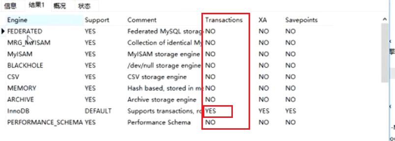
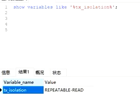
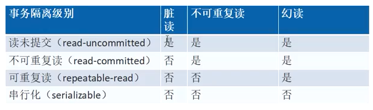

# MySQL事务

## 一、事务的简介

### 1.1 、为什么需要事务？

数据库的操作是多用户、多程序、多线程的，为保证数据的一致性，所以提出了事务的概念。

### 1.2、那些存储引擎支持事务？

show engines；

#查看默认的存储引擎

show variables like '%storage_engines%';

#查看某张表的存储引擎

show create table 表名;

#修改表的存储引擎为InnoDB

alter table 表名 engine=InnoDB;

### 二、事务的特性

### 2.1、ACID特性

原子性：事务不可分割，全执行或全不执行

一致性：事务必须是使数据库从一个一致性状态变成另一个一致性状态。

隔离性：并发执行的事务之间不能相互干扰。

持久性：事务一旦提交，对数据中的改变是永久性的，接下来的其他操作和故障不应该对其有影响。

### 2.2、事务的隔离性（重点）

隔离性：隔离性要求一个事务对数据库中数据的修改，在未提交完成前对于其他事务是不可见的。

- 读未提交（READ UNCOMMIT）脏读
- 读已提交（READ COMMIT）不可重复读
- 可重复读（REPEATABLE READ）幻读
- 序列化（SERIALIZABLE）

MySQL默认的隔离级别是可重复读，其他一般的数据库是读已提交。MySQL是可重复读是历史原因造成的，在MySQL5.0前binlog只支持STATEMENT这种格式！而这种格式在读已提交(Read Commited)这个隔离级别下主从复制是有bug的，因此Mysql将可重复读(Repeatable Read)作为默认的隔离级别！

**秒懂：**

#设置当前session的事务隔离级别

SET SESSION TRANSACTION ISOLATION LEVEL READ UNCOMMITTED;

**事务隔离级别总结：**

- 事务的隔离级别为可重复读时，如果有索引（包括主键索引）的时候，以索引列为条件更新数据，会存在间隙锁、行锁、页锁的问题，从而锁住一些行；如果没有索引，更新数据时会锁住整张表。
- 事务隔离级别为串行化时，**读写**数据都会锁住整张表。
- 隔离级别越高，越能保证数据完整性和一致性，但是对并发性能的影响也越大。对于多数应用程序，可以优先考虑把数据库的隔离级别设为Read Committed，它能够避免脏读，而且具有较好的性能。

## 三、事物的语法

### 3.1、开启事物的三种语法

~~~sql
1. begin;
2. start transaction; (推荐)
3. begin work;
~~~

### 3.2、事物提交

commit;

### 3.3、事物的回滚

rollback;

### 3.4、还原点

~~~sql
savepoint savepoint1;
# 查看自动提交设置
show variables like '%autocommit%';
# 关闭自动提交
set autocommit=0;
# 还原点演示
insert into demotest values(5,5,5);
savepoint s1;# 还原点s1
insert into demotest values(6,6,6);
savepoint s2;# 还原点s2
insert into demotest values(7,7,7);
savepoint s3;# 还原点s3
rollback to savepoint s2; # 还原到s2

~~~

